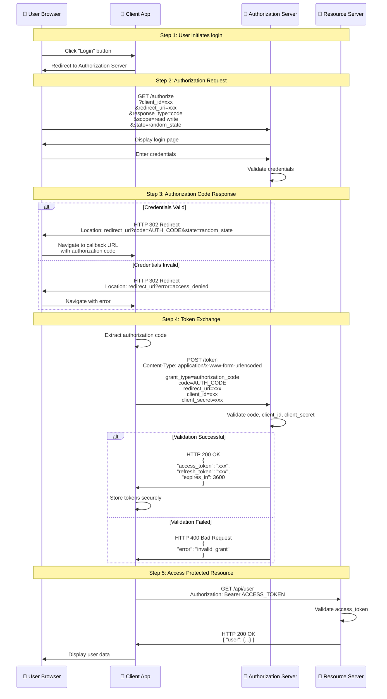
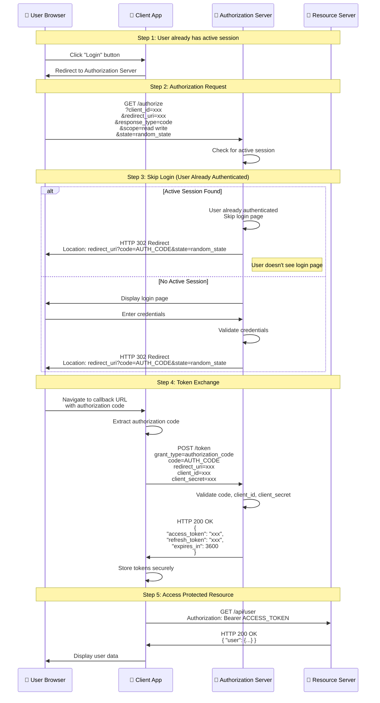
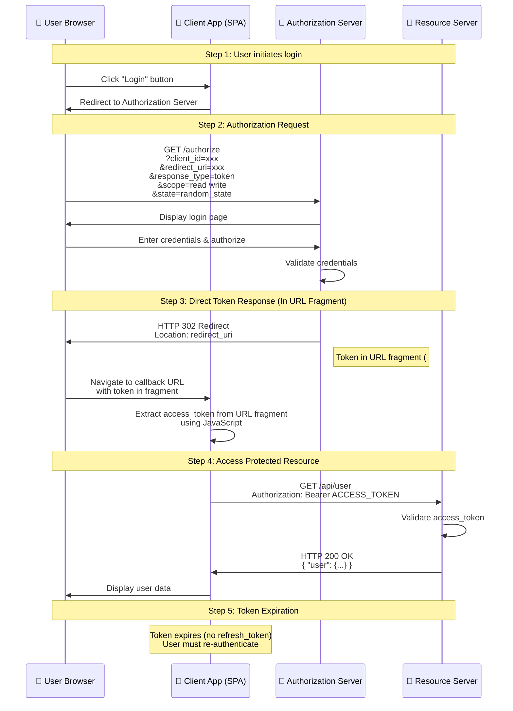
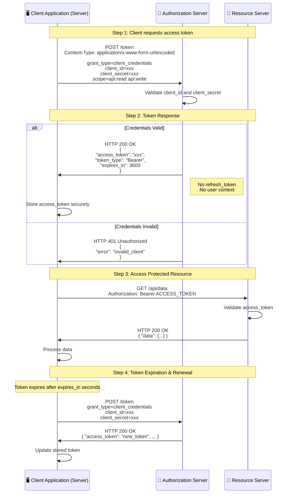

# OAuth 2.0 Flows Comparison - Sequence Diagrams & Analysis

This document provides detailed sequence diagrams and analysis for different OAuth 2.0 authorization flows, including their limitations and solutions.

---

## 1. Authorization Code Flow (When Not Authenticated)

This is the standard Authorization Code flow where the user needs to authenticate with the authorization server.

### Sequence Diagram

### Limitations

1. **Requires Client Secret**: Traditional flow requires `client_secret`, which cannot be securely stored in public clients (SPAs, mobile apps)
2. **Authorization Code Interception**: Authorization codes can be intercepted if transmitted over insecure channels
3. **Two Round Trips**: Requires two round trips (authorization request + token exchange), adding latency
4. **State Management**: Requires proper state parameter handling to prevent CSRF attacks
5. **Code Expiration**: Authorization codes expire quickly (1-10 minutes), requiring quick exchange

### Solutions

1. **PKCE (Proof Key for Code Exchange)**: 
   - Eliminates need for client_secret in public clients
   - Adds code_verifier/challenge mechanism
   - Prevents authorization code interception attacks
   - **This is what we implemented in the demo app**

2. **HTTPS Only**: Always use HTTPS to protect authorization codes in transit

3. **Short Code Lifetime**: Keep authorization codes short-lived (1-10 minutes)

4. **State Parameter**: Use cryptographically random state values to prevent CSRF

---

## 2. Authorization Code Flow (When Authenticated)

This flow occurs when the user is already authenticated with the authorization server (has an active session).

### Sequence Diagram

### Limitations

1. **Silent Authentication Risk**: Users may not realize they're granting access if login is skipped
2. **Session Hijacking**: If authorization server session is compromised, attacker can get authorization codes
3. **Same Limitations as Standard Flow**: Still requires client_secret (unless using PKCE)
4. **Consent Bypass**: May bypass consent screen if user previously authorized, potentially granting access without explicit consent

### Solutions

1. **Explicit Consent**: Use `prompt=consent` parameter to force consent screen even when authenticated
2. **PKCE**: Same PKCE solution as above
3. **Session Security**: Authorization server should implement strong session security (HttpOnly cookies, SameSite attributes)
4. **Re-authentication**: For sensitive operations, require re-authentication with `prompt=login`

---

## 3. Implicit Flow

This flow was designed for public clients (SPAs) but is now **deprecated** due to security concerns. It returns access tokens directly in the redirect URI fragment.

### Sequence Diagram

### Limitations

1. **Token Exposure**: Access tokens are exposed in URL fragment, browser history, and server logs
2. **No Refresh Tokens**: Cannot refresh expired tokens; user must re-authenticate
3. **Token Theft**: Tokens can be stolen from browser history, referrer headers, or JavaScript access
4. **No Token Validation**: Client cannot verify token before using it
5. **Deprecated**: OAuth 2.1 and security best practices recommend against this flow
6. **Short Token Lifetime**: Tokens typically have shorter lifetimes, causing frequent re-authentication

### Solutions

1. **Use Authorization Code Flow with PKCE**: 
   - **Recommended replacement** for Implicit Flow
   - Tokens never exposed in URLs
   - Supports refresh tokens
   - More secure for public clients

2. **If Must Use Implicit Flow** (legacy systems):
   - Use very short token lifetimes (5-15 minutes)
   - Implement token rotation
   - Clear browser history after token extraction
   - Use `state` parameter for CSRF protection
   - Never log URLs containing tokens

3. **Migration Path**: Migrate existing Implicit Flow implementations to Authorization Code Flow with PKCE

---

## 4. Client Credentials Flow

This flow is used for server-to-server communication where there is no user involved (machine-to-machine).

### Sequence Diagram

### Limitations

1. **No User Context**: Cannot access user-specific resources; only application-level resources
2. **No Refresh Tokens**: Must re-authenticate when token expires (though this is automatic)
3. **Secret Management**: Client secret must be stored securely on the server
4. **Broad Permissions**: Token grants access to all scopes requested, not user-specific permissions
5. **No Delegation**: Cannot delegate user permissions; only application permissions
6. **Secret Rotation**: Changing client_secret requires updating all instances

### Solutions

1. **Secure Secret Storage**:
   - Use environment variables or secret management services (AWS Secrets Manager, HashiCorp Vault)
   - Never commit secrets to version control
   - Rotate secrets regularly

2. **Token Caching**:
   - Cache tokens until near expiration
   - Implement automatic token refresh before expiration
   - Use token introspection endpoint to verify validity

3. **Scope Limitation**:
   - Request only necessary scopes
   - Use different client credentials for different operations
   - Implement principle of least privilege

4. **Token Introspection**:
   - Use OAuth 2.0 Token Introspection (RFC 7662) to verify token validity
   - Check token expiration before use

5. **IP Whitelisting**: Restrict client credential usage to specific IP addresses

6. **Audit Logging**: Log all client credential usage for security monitoring

---

## Flow Comparison Summary

| Flow | Use Case | Security Level | Refresh Tokens | User Context | Status |
|------|----------|----------------|----------------|--------------|--------|
| **Authorization Code (Not Auth)** | User login (web apps) | ⭐⭐⭐⭐ High | ✅ Yes | ✅ Yes | ✅ Recommended |
| **Authorization Code (Auth)** | User login (with session) | ⭐⭐⭐⭐ High | ✅ Yes | ✅ Yes | ✅ Recommended |
| **Authorization Code + PKCE** | Public clients (SPAs) | ⭐⭐⭐⭐⭐ Very High | ✅ Yes | ✅ Yes | ✅ **Best Practice** |
| **Implicit Flow** | Public clients (legacy) | ⭐⭐ Low | ❌ No | ✅ Yes | ⚠️ **Deprecated** |
| **Client Credentials** | Server-to-server | ⭐⭐⭐ Medium | ❌ No | ❌ No | ✅ Recommended |

---

## Recommendations

### For SPAs (Single Page Applications)
✅ **Use: Authorization Code Flow with PKCE**
- Most secure option for public clients
- Supports refresh tokens
- Prevents authorization code interception
- **This is what our demo app implements**

### For Traditional Web Applications
✅ **Use: Authorization Code Flow**
- Secure with client_secret stored on server
- Full user context and refresh tokens

### For Mobile Applications
✅ **Use: Authorization Code Flow with PKCE**
- Same as SPAs - public client, no client_secret needed
- Secure for mobile apps

### For Server-to-Server APIs
✅ **Use: Client Credentials Flow**
- Appropriate for machine-to-machine communication
- No user context needed

### Never Use
❌ **Implicit Flow**
- Deprecated and insecure
- Migrate to Authorization Code + PKCE

---

## Security Best Practices Summary

1. **Always use HTTPS** for all OAuth flows
2. **Use PKCE** for all public clients (SPAs, mobile apps)
3. **Validate state parameter** to prevent CSRF attacks
4. **Store tokens securely** (HttpOnly cookies for web, Keychain/Keystore for mobile)
5. **Implement token refresh** before expiration
6. **Use short-lived tokens** with refresh capability
7. **Request minimal scopes** (principle of least privilege)
8. **Validate redirect URIs** to prevent open redirects
9. **Log and monitor** authentication events
10. **Rotate secrets regularly** for client credentials
