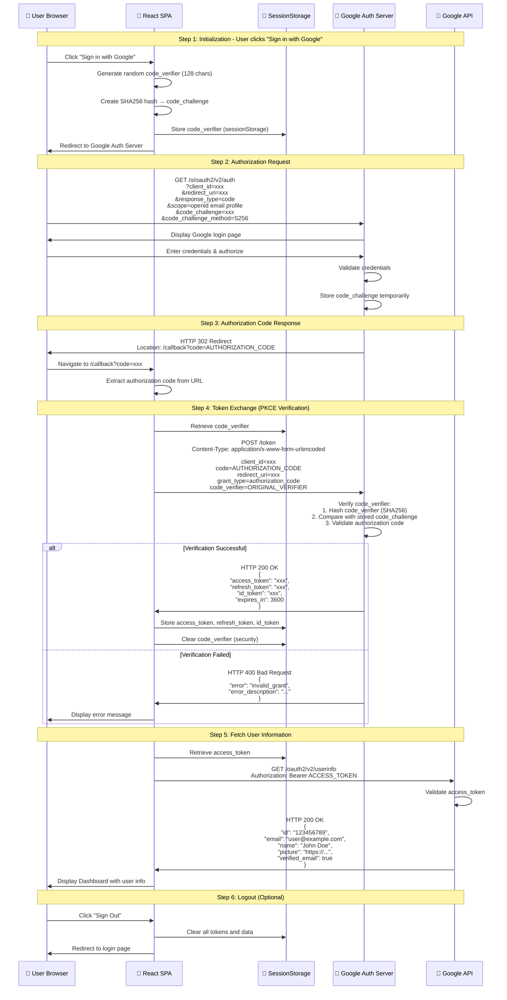

# PKCE Google Login Flow - Sequence Diagram

This document contains a detailed sequence diagram explaining the complete PKCE (Proof Key for Code Exchange) flow for Google OAuth authentication.

> **Note**: For a comparison of different OAuth 2.0 flows (Authorization Code, Implicit, Client Credentials) and their limitations, see [OAUTH_FLOWS_COMPARISON.md](./OAUTH_FLOWS_COMPARISON.md)

## Mermaid Sequence Diagram

## Flow Explanation

### Phase 1: PKCE Setup (Client-Side)
1. **Code Verifier Generation**: The app generates a cryptographically random string (43-128 characters) using URL-safe characters
2. **Code Challenge Creation**: The verifier is hashed using SHA256 and base64url-encoded
3. **Storage**: The original verifier is stored in sessionStorage (not sent to Google yet)

### Phase 2: Authorization Request
1. **Redirect to Google**: User is redirected to Google's authorization server with:
   - `client_id`: Your Google OAuth client ID
   - `redirect_uri`: Where Google should send the user back
   - `response_type=code`: Requesting an authorization code
   - `code_challenge`: The SHA256 hash (not the verifier!)
   - `code_challenge_method=S256`: Indicates SHA256 was used

### Phase 3: User Authorization
1. **Google Login**: User authenticates with Google
2. **Authorization Code**: Google generates a short-lived authorization code
3. **Redirect**: User is redirected back to your app with the code

### Phase 4: Token Exchange (PKCE Verification)
1. **Retrieve Verifier**: App retrieves the original code_verifier from sessionStorage
2. **Token Request**: App sends both the authorization code AND the code_verifier to Google
3. **PKCE Validation**: Google:
   - Hashes the code_verifier using SHA256
   - Compares it with the code_challenge from step 2
   - If they match, issues tokens
4. **Token Response**: Google returns access_token, refresh_token, and id_token

### Phase 5: User Information Retrieval
1. **API Call**: App uses the access_token to fetch user profile from Google API
2. **Display**: User information is displayed in the dashboard

## Security Benefits of PKCE

1. **Prevents Authorization Code Interception**: Even if an attacker intercepts the authorization code, they cannot exchange it for tokens without the code_verifier
2. **No Client Secret Required**: Public clients (SPAs) don't need to store secrets
3. **Dynamic Challenge**: Each login uses a unique code_verifier/challenge pair
4. **One-Time Use**: Authorization codes are single-use and short-lived

## Key Security Points

- ✅ Code verifier is never sent to Google in the authorization request
- ✅ Only the code challenge (hash) is sent initially
- ✅ Code verifier is sent only during token exchange (over HTTPS)
- ✅ Verifier is cleared from storage after successful exchange
- ✅ Authorization codes expire quickly (typically 1-10 minutes)
- ✅ Tokens are stored in sessionStorage (cleared on browser close)
