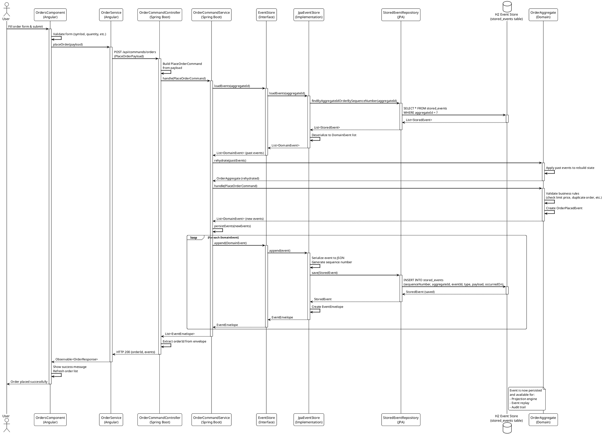
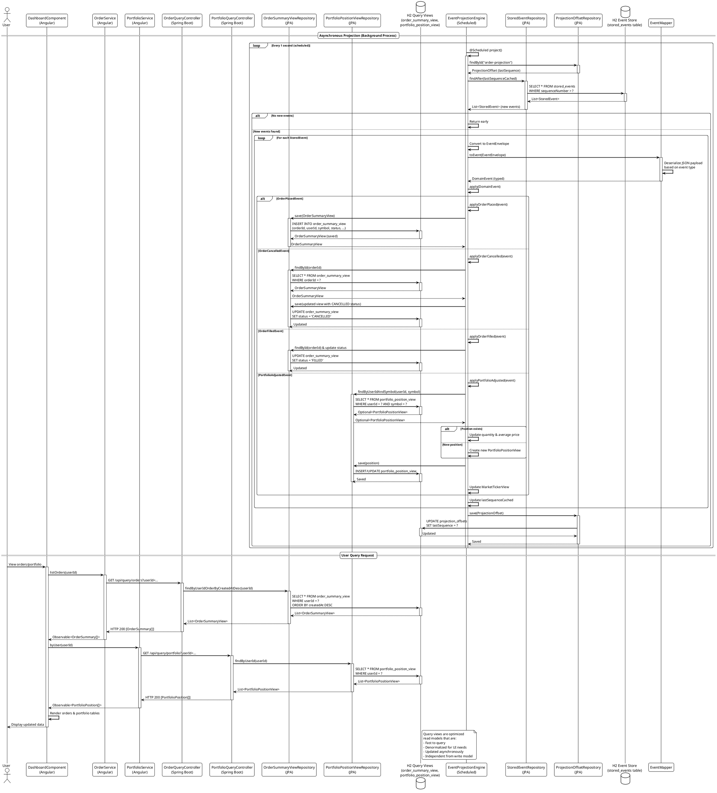
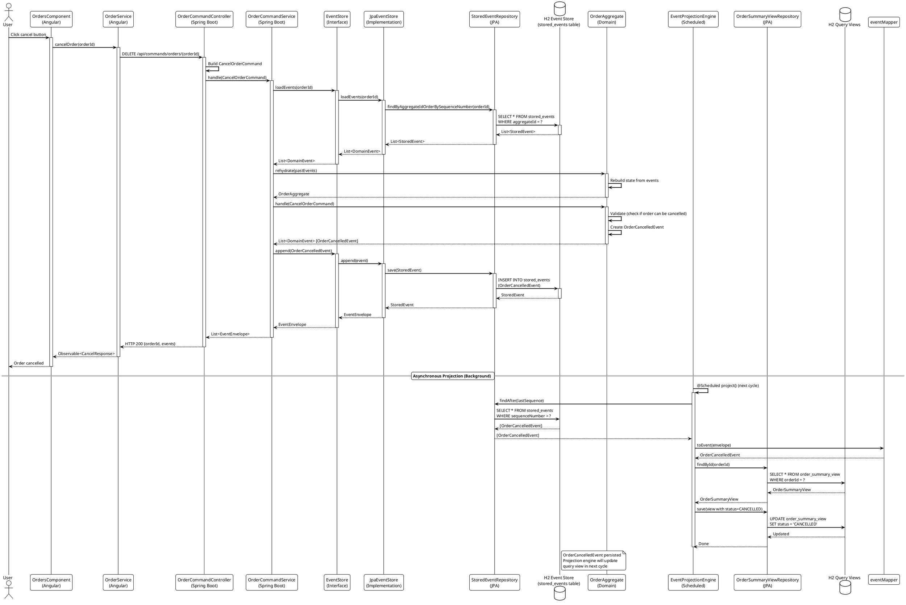

# Stock Exchange Terminal – Technical Design Document

## 1. System Overview

- **Purpose**: Provide a realistic trading terminal that allows users to register, place orders, manage portfolios, and monitor market data while demonstrating a CQRS + Event Sourcing architecture.
- **Architecture**: Multi-microservice, event-driven system with a shared event store and materialized query views.
- **Technology Stack**
  - **Backend**: Maven multi-module project, Spring Boot 3, Java 17, H2, Lombok, JPA.
  - **Frontend**: Angular 18 standalone application, RxJS, Reactive Forms, SCSS.
  - **Real-time Feed**: Spring WebFlux (Server-Sent Events) for synthetic market data.

## 2. Microservice Architecture

### Service Responsibilities

| Service | Port | Responsibilities | Data Source |
| --- | --- | --- | --- |
| `identity-service` | 8081 | User registration & authentication, deterministic demo users | `jdbc:h2:file:./data/identity-db` |
| `trading-command-service` | 8082 | CQRS command side; validates commands, persists domain events | `jdbc:h2:file:../shared/event-store` |
| `trading-query-service` | 8083 | CQRS query side; projects domain events into read models, exposes REST queries | `jdbc:h2:file:../shared/event-store` |
| `market-data-service` | 8084 | Emits synthetic market ticker updates via SSE | In-memory |

### Shared `common` Module

- Houses `commands`, `events`, `model` (value objects), and `util` packages.
- Provides `EventStore`, `EventMapper`, `EventEnvelope` abstractions to ensure identical serialization contracts in all services.

### Frontend

- `frontend/stock-terminal-ui`: Angular app with dashboard layout, login/registration, order entry, portfolio views, and live ticker feed.
- Communicates directly with each microservice via typed Angular services (`identity.service.ts`, `order.service.ts`, etc.).

## 3. Project Structure

```
backend/
  pom.xml                   # Aggregator
  common/                   # Shared domain contracts
  identity-service/         # User management microservice
  trading-command-service/  # Command side (write) microservice
  trading-query-service/    # Query side (read) microservice
  market-data-service/      # SSE market data generator
frontend/
  stock-terminal-ui/        # Angular dashboard app
```

## 4. CQRS + Event Sourcing Flow

```
[Angular Client]
  └─ POST /api/commands/orders (Place order command)
      ↓
[trading-command-service]
  1. Rehydrate OrderAggregate from event store
  2. Validate and execute command
  3. Append DomainEvent(s) to shared event store (H2 table `stored_events`)
      ↓ (shared event store)
[trading-query-service]
  4. Scheduled projection engine polls new events
  5. Materialize into query tables:
        - order_summary_view
        - portfolio_position_view
        - market_ticker_view
      ↓
[Angular Client]
  6. Polls query endpoints for updated state
```

- Commands never update read models directly; they emit immutable events.
- Query models are updated asynchronously by consuming the stored events.
- Read APIs are optimized for UI needs and are independent from write models.

## 5. Database Schema Highlights

### Event Store (`trading-command-service` and `trading-query-service`)

- **Table**: `stored_events`
  - `sequenceNumber` (auto-increment, PK)
  - `aggregateId`
  - `eventId`
  - `type`
  - `payload` (JSON string)
  - `occurredOn`
- Shared file-based H2 database (`../shared/event-store`) to simulate durable event storage.

### Query Views (`trading-query-service`)

- `order_summary_view`: contains order metadata and status, indexed by `userId` and `symbol`.
- `portfolio_position_view`: aggregates quantity and average price per user & symbol.
- `market_ticker_view`: latest ticker stats per symbol.
- `projection_offsets`: checkpoint table storing last processed sequence.

### Identity Service

- `user_accounts`: stores deterministic UUIDs, email, display name, hashed password, roles, created timestamp.

## 6. Detailed Data Flows

### 6.1 Registration & Login
1. Angular `LoginComponent` uses `IdentityService` to POST credentials to `/api/users/register` or `/api/users/login`.
2. `identity-service` persists `UserAccount` (if registering) and issues an ephemeral token (UUID stored in memory).
3. Frontend caches returned `UserProfile`; `X-Auth-Token` header used for authenticated profile requests.

### 6.2 Place Order (CQRS Write Path)
1. `OrdersComponent` validates reactive form, capitalizes symbol, builds `PlaceOrderPayload`.
2. Angular `OrderService` POSTs the payload to `trading-command-service`.
3. `OrderCommandController` constructs `PlaceOrderCommand` and delegates to `OrderCommandService`.
4. `OrderCommandService` uses `EventStore.loadEvents` to hydrate `OrderAggregate`.
5. `OrderAggregate.handle` enforces invariants (duplicate id, limit price) and emits `OrderPlacedEvent`.
6. `JpaEventStore.append` persists serialized JSON to `stored_events`; returns `EventEnvelope`.
7. Controller returns `orderId` and event metadata to the client.

### 6.3 Query Orders / Portfolio (CQRS Read Path)
1. Frontend polls `trading-query-service` (e.g., `/api/query/orders?userId=...`).
2. `EventProjectionEngine` (scheduled every second) processes new entries from `stored_events`.
3. Redistributes events into JPA-managed read tables.
4. Query controllers fetch from JPA repositories and return aggregated results.

### 6.4 Market Data Streaming
1. Angular `MarketDataService` loads snapshot via REST then opens SSE connection (`/api/market-data/stream`).
2. `MarketDataGeneratorService` emits randomized `TickerSnapshot` every two seconds using `Sinks.many().multicast()` and `Flux.interval`.
3. Angular merges new tickers into `BehaviorSubject` for live updates in `MarketTickerComponent`.

## 7. Sequence Diagrams (PlantUML)

### 7.1 Place Order Command Flow (CQRS Write Path)

This diagram shows the complete flow when a user places an order, demonstrating the event sourcing pattern where domain events are persisted to the event store.




### 7.2 Query Orders/Portfolio Flow (CQRS Read Path)

This diagram shows how the query side works, including the asynchronous projection engine that materializes events into read models, and how the frontend queries these optimized views.



### 7.3 Cancel Order Command Flow

This diagram shows the cancel order flow, which follows the same event sourcing pattern as placing an order.




## 8. Key Classes & Components

### Domain & Command Side
- `OrderAggregate`: Event-sourced aggregate with logic to rehydrate state and emit domain events (`handle`, `apply` methods).
- `OrderCommandService`: Delegates command handling to aggregate, persists results via `EventStore`.
- `JpaEventStore`: Implements `EventStore`, serializes events via Jackson, interacts with `StoredEventRepository`.
- `EventMapper`: Maintains registry of event type deserializers, ensuring safe JSON-to-domain conversion.

### Query Side
- `EventProjectionEngine`: Scheduled component applying events onto JPA read models with checkpointing (`ProjectionOffsetRepository`).
- `OrderSummaryViewRepository`, `PortfolioPositionViewRepository`, `MarketTickerViewRepository`: standard Spring Data repositories for query tables.
- `ProjectionOffset`: JPA entity storing last processed sequence per projection name.

### Identity Service
- `UserAccountService`: Manages registration, authentication, and deterministic seeding. Uses `PasswordEncoder`.
- `UserController`: Exposes `/register`, `/login`, `/profile`; stores tokens in a concurrent map for demo purposes.

### Market Data Service
- `MarketDataGeneratorService`: Generates periodic price updates from seeded base snapshots, applying random variance.
- `MarketDataController`: REST + SSE endpoints for snapshot and stream.

### Frontend Components & Services
- `IdentityService`: Manages authentication state (`BehaviorSubject<UserProfile>`), exposes `register`, `login`, `logout`.
- `OrderService`: REST client for command/query endpoints pertaining to orders.
- `PortfolioService`: Fetches portfolio positions by user.
- `MarketDataService`: Combines HTTP snapshot with SSE stream, exposes `tickers$`.
- `DashboardComponent`: Shell showing orders, portfolio, and market ticker components for authenticated users.
- `LoginComponent`: Handles login/registration modes via reactive forms.
- `OrdersComponent`: Renders existing orders and order entry form, dispatches commands.
- `PortfolioComponent`: Displays position table with refresh.
- `MarketTickerComponent`: Subscribes to live ticker feed.

## 9. CQRS & Event Sourcing Compliance

1. **Command/Query Segregation**
   - `trading-command-service` exposes only command endpoints (`/api/commands`). It never reads or mutates query models.
   - `trading-query-service` exposes only query endpoints (`/api/query`). It never issues commands or mutate aggregates.

2. **Event Sourcing**
   - All domain state derives from event history; `OrderAggregate.rehydrate` uses past events to rebuild current state.
   - Event log stored immutably in `stored_events` with sequence numbers for deterministic ordering.

3. **Asynchronous Projection**
   - `EventProjectionEngine` consumes events after they are persisted, updating materialized read models asynchronously.
   - `ProjectionOffset` table guarantees idempotent, incremental projections.

4. **Shared Contracts**
   - `common` module provides strongly typed commands/events shared at compile time, preventing schema drift.

5. **Automated Validation**
   - Unit tests (`OrderCommandServiceTest`, `EventProjectionEngineTest`, `UserAccountServiceTest`) assert key invariants and projection correctness.
   - Seeds populate deterministic UUIDs so frontend workflows have meaningful data immediately.

## 10. Deployment Notes

- Each microservice can run individually (`mvn spring-boot:run`). For production, a persistent database (e.g., PostgreSQL) should replace the shared H2 file.
- Frontend is served via `npm start` and expects services at `localhost:8081-8084`.
- CORS is enabled (via `@CrossOrigin(origins = "*")`) for demo simplicity; lock down origins for production.
- For containerized deployment, map shared storage for the event store or replace with managed storage solution.

## 11. Future Enhancements

- Integrate a message broker (Kafka/RabbitMQ) for projections instead of polling.
- Expand domain events to capture partial fills, settlements, and order books.
- Harden authentication (JWT tokens, refresh flow).
- Add integration/E2E tests spanning full command → projection → query cycle.
- Introduce monitoring/metrics (e.g., Micrometer, Prometheus) for event processing.

---

This document reflects the current implementation and highlights how CQRS and Event Sourcing patterns are realized across microservices, shared contracts, and the Angular client experience.

